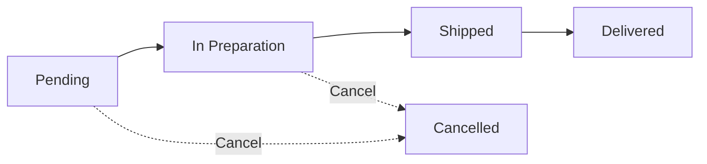
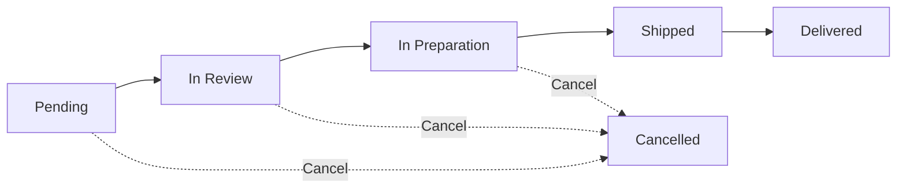

# Sainapsis Order Management System

<div align="center">


**Sainapsis Frontend Developer Technical Test**

*A modern, robust order management system with state machine implementation*

[Installation](#installation--setup) • [Usage](#usage-guide) • [Architecture](#architecture--design-decisions)

</div>

---

## Table of Contents

- [About the Project](#about-the-project)
- [Features](#features)
- [Tech Stack](#tech-stack)
- [Installation & Setup](#installation--setup)
- [Usage Guide](#usage-guide)
- [Project Structure](#project-structure)
- [State Machine Logic](#state-machine-logic)
- [Architecture & Design Decisions](#architecture--design-decisions)
- [Evaluation Criteria Compliance](#evaluation-criteria-compliance)
- [Author](#author)

---

## About the Project

This project is a **frontend application in React** developed as part of the Sainapsis Frontend Developer technical assessment. It implements a sophisticated **order management system** with a **state machine** that controls order flow with specific validation rules based on order amounts.

The application demonstrates expertise in:
- Advanced React patterns and best practices
- TypeScript for type safety
- State machine implementation
- Component-based architecture
- Modern UI/UX design with Shadcn/ui

### Technical Test Requirements Met

This project fulfills all requirements specified in the Sainapsis Frontend Developer Test:

1. **React User Interface** - Complete order creation form and transition logs view
2. **Main Order Management View** - Interactive order cards with state-based actions
3. **State Machine Implementation** - Robust state machine with validation rules
4. **Entity Attributes** - Complete order and state transition models
5. **Transition Logs View** - Filterable history of all state transitions
6. **Componentization** - Well-organized, reusable components
7. **Style and Design** - Intuitive UI built with Shadcn/ui components

---

## Features

### Core Functionality

#### Order Management
- **Create Orders** - Comprehensive form with customer info, multiple products, and notes
- **View Orders** - Card-based layout with all order details
- **State Transitions** - Action buttons for valid state changes
- **High-Value Detection** - Automatic detection and special handling for orders >$1,000

#### State Machine
- **Predefined States**: Pending → In Preparation → Shipped → Delivered
- **Review Process**: Orders >$1,000 require review: Pending → In Review → In Preparation
- **Cancellation**: Orders can be cancelled before shipping
- **Validation**: States cannot be skipped; strict transition rules enforced

#### Transition Logs
- **Complete History** - All state transitions recorded with timestamps
- **Filtering** - Search by Order ID
- **Detailed Information** - Previous state, new state, action taken, and date/time

### User Experience

#### Modern UI/UX
- **Responsive Design** - Works seamlessly on desktop, tablet, and mobile
- **Color-Coded States** - Visual feedback with distinct colors for each state
- **Intuitive Navigation** - Tab-based navigation between views
- **Real-Time Updates** - Instant UI updates on all actions
- **Visual Indicators** - High-value order badges and status indicators

#### Accessibility
- **Keyboard Navigation** - Full keyboard support
- **Screen Reader Support** - Proper ARIA labels
- **Focus Management** - Clear focus indicators

---

## Tech Stack

### Frontend Framework
- **React 18.3.1** - Modern UI library with hooks
- **TypeScript 5.6.2** - Type-safe JavaScript
- **Vite 7.3.0** - Lightning-fast build tool

### Styling & UI
- **Tailwind CSS 3.4** - Utility-first CSS framework
- **Shadcn/ui** - High-quality, accessible component library
- **Lucide React** - Beautiful, consistent icon set
- **Radix UI** - Unstyled, accessible component primitives

### State Management & Routing
- **React Context API** - Global state management
- **React Router DOM** - Client-side routing

### Development Tools
- **ESLint** - Code quality and consistency
- **PostCSS** - CSS transformation
- **Autoprefixer** - CSS vendor prefixing

---

## Installation & Setup

### Prerequisites

Before you begin, ensure you have the following installed:
- **Node.js** 18.x or higher ([Download](https://nodejs.org/))
- **npm** or **yarn** package manager

### Installation Steps

1. **Clone the repository**
   ```bash
   git clone https://github.com/diegcard/Sainapsis-Frontend-Developer-Test.git
   cd Sainapsis-Frontend-Developer-Test
   ```

2. **Install frontend dependencies**
   ```bash
   npm install
   ```

3. **Configure environment**
   ```bash
   # Copy the environment example file
   cp .env.example .env
   
   # Edit .env if needed (default: http://localhost:3000/api)
   ```

4. **Install and start the Backend** (Required for API communication)
   ```bash
   cd backend-nestjs
   npm install
   npm run start:dev
   ```
   The backend will run at `http://localhost:3000`

5. **Start the Frontend** (in a new terminal)
   ```bash
   # From the root project folder (not backend-nestjs)
   npm run dev
   ```

6. **Open your browser**
   
   Navigate to `http://localhost:5173`

### Project Structure

```
Sainapsis-Frontend-Developer-Test/   # Root (Frontend)
├── src/                             # Frontend source code
├── backend-nestjs/                  # Backend folder (inside frontend)
├── package.json                     # Frontend dependencies
└── ...
```

### Backend Integration

This frontend is designed to work with the NestJS backend located in the `backend-nestjs` folder. Make sure the backend is running before using the application:

- **Backend URL**: `http://localhost:3000/api`
- **Frontend URL**: `http://localhost:5173`

The API configuration can be changed in the `.env` file:
```env
VITE_API_URL=http://localhost:3000/api
```

### Available Scripts

```bash
# Start development server with hot reload
npm run dev

# Build for production
npm run build

# Preview production build locally
npm run preview

# Run linter
npm run lint
```

### Build for Production

```bash
npm run build
```

The production-ready files will be generated in the `dist` directory. You can deploy this folder to any static hosting service.

---

## Usage Guide

### Creating a New Order

1. Click the **"Create New Order"** button in the Orders view
2. Fill in the customer information:
   - Customer Name (required)
   - Customer Email (required)
3. Add product details:
   - Product Name (required)
   - Quantity (required, minimum 1)
   - Unit Price (required, minimum 0)
4. Add more products using the **"Add Product"** button if needed
5. Optionally add notes or special instructions
6. View the calculated total amount
7. Click **"Create Order"** to submit

**Note**: Orders over $1,000 will require review before preparation.

### Managing Orders

#### Order Card Information
Each order card displays:
- Order ID (first 8 characters)
- Current state with color-coded badge
- Total amount
- Customer name and email
- Product list with quantities and prices
- Creation date
- Optional notes
- Available action buttons

#### State Transitions

**For orders ≤ $1,000:**
```
Pending → In Preparation → Shipped → Delivered
```

**For orders > $1,000:**
```
Pending → In Review → In Preparation → Shipped → Delivered
```

**Available Actions by State:**

| Current State | Available Actions |
|--------------|-------------------|
| **Pending** (≤$1,000) | Start Preparation, Cancel Order |
| **Pending** (>$1,000) | Review Order, Cancel Order |
| **In Review** | Approve Review, Cancel Order |
| **In Preparation** | Send Order, Cancel Order |
| **Shipped** | Confirm Delivery |
| **Delivered** | No actions available |
| **Cancelled** | No actions available |

### Viewing Transition Logs

1. Navigate to the **"Transition Logs"** tab
2. View the complete history of all state transitions
3. Use the search input to filter by Order ID
4. Each log entry shows:
   - Order ID and customer name
   - Previous state → New state
   - Action taken
   - Date and time of transition

---

## Project Structure

```
Sainapsis-Frontend-Developer-Test/
├── src/
│   ├── components/              # React components
│   │   ├── orders/             # Order-related components
│   │   │   ├── CreateOrderDialog.tsx    # Order creation form
│   │   │   ├── OrderCard.tsx            # Individual order card
│   │   │   └── OrderList.tsx            # Order grid container
│   │   ├── transitions/        # Transition log components
│   │   │   └── TransitionLog.tsx        # Transition history view
│   │   └── ui/                 # Shadcn/ui base components
│   │       ├── button.tsx
│   │       ├── card.tsx
│   │       ├── dialog.tsx
│   │       ├── input.tsx
│   │       ├── label.tsx
│   │       ├── tabs.tsx
│   │       ├── textarea.tsx
│   │       └── badge.tsx
│   ├── context/                # React Context providers
│   │   └── OrderContext.tsx    # Global order state management
│   ├── layouts/                # Layout components
│   │   └── Layout.tsx          # Main app layout with navigation
│   ├── lib/                    # Utility functions
│   │   └── utils.ts            # Helper functions
│   ├── pages/                  # Page components
│   │   ├── OrdersPage.tsx      # Main orders view
│   │   └── TransitionsPage.tsx # Transition logs view
│   ├── services/               # Business logic
│   │   └── orderStateMachine.ts # State machine implementation
│   ├── types/                  # TypeScript definitions
│   │   └── order.types.ts      # Order and transition types
│   ├── App.tsx                 # Root component
│   ├── main.tsx                # Application entry point
│   └── index.css               # Global styles
├── public/                     # Static assets
├── .gitignore                  # Git ignore rules
├── package.json                # Project dependencies
├── tsconfig.json               # TypeScript configuration
├── vite.config.ts              # Vite configuration
├── tailwind.config.js          # Tailwind CSS configuration
├── postcss.config.js           # PostCSS configuration
└── README.md                   # Project documentation
```

---

## State Machine Logic

### State Definitions

```typescript
export const OrderState = {
  PENDING: 'Pending',
  IN_REVIEW: 'In Review',
  IN_PREPARATION: 'In Preparation',
  SHIPPED: 'Shipped',
  DELIVERED: 'Delivered',
  CANCELLED: 'Cancelled',
} as const;
```

### State Transition Rules

#### Standard Flow (Orders ≤ $1,000)


#### High-Value Flow (Orders > $1,000)


### Validation Rules

1. **High-Value Order Rule**
   - Orders with amount > $1,000 **must** go through review
   - Cannot skip the review process
   - Visual indicator shown on order card

2. **Sequential State Transitions**
   - States cannot be skipped
   - Each state transition must follow the defined flow
   - Invalid transitions are blocked by the state machine

3. **Cancellation Rules**
   - Orders can only be cancelled before "Shipped" state
   - Once shipped, cancellation is not allowed
   - Delivered and Cancelled are terminal states

4. **Action Availability**
   - Only valid actions are shown for each state
   - Actions are disabled if prerequisites aren't met
   - Terminal states show no available actions

### State Machine Implementation

The state machine is implemented in `src/services/orderStateMachine.ts` with the following key methods:

```typescript
class OrderStateMachine {
  // Check if a transition is valid
  static isValidTransition(order: Order, action: OrderAction): boolean
  
  // Get the next state for an action
  static getNextState(currentState: OrderState, action: OrderAction): OrderState | null
  
  // Get available actions for an order
  static getAvailableActions(order: Order): OrderAction[]
  
  // Execute a transition and create a log
  static executeTransition(order: Order, action: OrderAction)
}
```

---

## Architecture & Design Decisions

### Component Architecture

#### Atomic Design Principles
- **Atoms**: UI components (button, input, badge)
- **Molecules**: OrderCard, TransitionLog item
- **Organisms**: OrderList, TransitionLog container
- **Templates**: Layout with navigation
- **Pages**: OrdersPage, TransitionsPage

#### Component Responsibilities

```typescript
// Smart Components (Container)
- OrdersPage: Coordinates order display
- TransitionsPage: Coordinates transition logs
- Layout: App structure and navigation

// Presentation Components
- OrderCard: Displays individual order
- OrderList: Grid of order cards
- CreateOrderDialog: Order creation form
- TransitionLog: Transition history display

// UI Components (Shadcn/ui)
- Reusable, accessible primitives
- Consistent styling and behavior
```

### State Management Strategy

#### Context API Usage
- **OrderContext**: Global order and transition state
- **Provider Pattern**: Wraps entire application
- **Custom Hooks**: `useOrders()` for component access

#### Why Context API?
- Built-in React solution
- Sufficient for application size
- No external dependencies
- Simple and maintainable
- Type-safe with TypeScript

### Type Safety

#### TypeScript Benefits
- Compile-time type checking
- IntelliSense and autocomplete
- Refactoring safety
- Self-documenting code
- Reduced runtime errors

#### Type Organization
```typescript
// Const types for enums
export const OrderState = {...} as const;
export type OrderState = typeof OrderState[keyof typeof OrderState];

// Interface definitions
export interface Order {...}
export interface StateTransition {...}
```

### Styling Approach

#### Tailwind CSS Benefits
- Utility-first approach
- Rapid development
- Consistent design system
- Purged unused CSS in production
- Responsive design utilities

#### Shadcn/ui Integration
- Pre-built accessible components
- Customizable with Tailwind
- Copy-paste architecture
- No runtime dependencies
- Full control over code

---

## License

This project was created as part of the Sainapsis technical assessment.

---

## Author

**Diego Cardenas**

Developed as part of the **Sainapsis Frontend Developer Technical Test** - December 2025

---

## Acknowledgments

- **Sainapsis** - For the opportunity to showcase my skills
- **Shadcn/ui** - For the excellent component library
- **Radix UI** - For accessible component primitives
- **Tailwind CSS** - For the utility-first CSS framework
- **Vite** - For the lightning-fast build tool

---

<div align="center">

**Built with React, TypeScript, and modern web technologies**

[Back to Top](#sainapsis-order-management-system)

</div>
